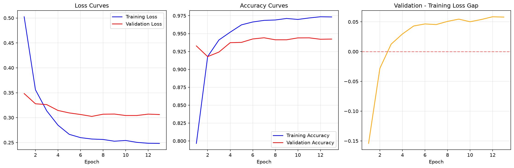

# Toxic Comment Classification and Redaction

A toxicity classifier (BiLSTM over word embeddings, trained on the Jigsaw
"Toxic Comment Classification Challenge" dataset) plus a redaction module
that masks flagged spans in toxic comments.

## Results

Trained on 48,000 real Jigsaw comments (stratified sample of the 159,571-row
training set) and evaluated on the untouched, officially labeled Kaggle test
set (63,978 comments):

| Metric | Value |
|---|---|
| Accuracy | 89.7% |
| AUC | 0.945 |
| Toxic recall | 0.85 |
| Toxic precision | 0.48 |
| Toxic F1 | 0.61 |



Precision is intentionally traded off for recall (via class weighting and a
validation-F1-tuned decision threshold): for comment moderation, missing
toxic content is usually worse than over-flagging borderline content.
Reproduce with `models/evaluation/evaluate_on_kaggle_test.py`.

## Folder Structure

```
models/
├── common/            # Shared data loading, model architecture, artifact paths
├── training/           # Model architecture and training scripts
├── analysis/           # Overfitting analysis and diagnosis tools
├── evaluation/         # Model testing and performance evaluation
├── inference/           # Scripts for using the trained model
└── redaction/           # Masks toxic spans in flagged comments
```

---

## training/

Scripts for building and training the model with overfitting prevention.

| File | Description |
|------|-------------|
| `fix_overfitted_model.py` | Full retraining pipeline with regularization, early stopping, and validation monitoring |
| `fixed_training_code.py` | Corrected training procedure — shows the key changes needed to prevent overfitting |
| `improved_model_template.py` | Reusable model architecture template with dropout, L2 regularization, and anti-overfitting callbacks |

---

## analysis/

Tools to detect and understand overfitting in the model.

| File | Description |
|------|-------------|
| `overfitting_analysis.py` | Comprehensive `OverfittingAnalyzer` class — checks model complexity, training history, data leakage, and performance gaps |
| `overfitting_diagnosis.py` | Diagnoses the current saved model and generates a prioritized action plan |
| `real_data_overfitting_analysis.py` | Analysis specific to the Jigsaw dataset — evaluates the 90M-parameter SimpleRNN model's overfitting |
| `check_training_curves.py` | Quick visual check of training vs. validation loss/accuracy curves |
| `quick_overfitting_demo.py` | Loads the saved model and demonstrates overfitting with concrete prediction examples |
| `quick_overfitting_check.py` | Minimal helper script for a fast overfitting check after training |

---

## evaluation/

Comprehensive test suites for measuring model performance and generalization.

| File | Description |
|------|-------------|
| `model_performance_test.py` | `ModelTester` class — runs basic, edge case, robustness, adversarial, calibration, and length-sensitivity tests |
| `test_fixed_model.py` | Tests the retrained fixed model and compares it against the original overfitted model |

---

## inference/

Ready-to-use interface for running the trained model.

| File | Description |
|------|-------------|
| `use_fixed_model.py` | `ToxicityClassifier` class with `predict()` and `batch_predict()` methods for classifying new text |

---

## redaction/

Masks toxic words/phrases in flagged comments.

| File | Description |
|------|-------------|
| `redact.py` | `ToxicRedactor` class - lexicon-based span masking, gated by the trained classifier so non-toxic uses of a trigger word ("you killed it out there") aren't redacted |

---

## Quick Start

### 1. Train the model
Real data (recommended): download `train.csv` from the [Jigsaw Toxic Comment
Classification Challenge](https://www.kaggle.com/competitions/jigsaw-toxic-comment-classification-challenge)
and either place it at `models/data/train.csv` or point `JIGSAW_TRAIN_CSV` at
it. Without real data, the script falls back to a smaller templated
synthetic dataset so it still runs end-to-end.
```bash
export JIGSAW_TRAIN_CSV=/path/to/train.csv
python models/training/fix_overfitted_model.py
```

### 2. Evaluate on the real, held-out Kaggle test set
```bash
python models/evaluation/evaluate_on_kaggle_test.py \
    --test-csv /path/to/test.csv --labels-csv /path/to/test_labels.csv
```

### 3. Run the broader test suite (edge cases, robustness, calibration)
```bash
python models/evaluation/model_performance_test.py
```

### 4. Classify new text
```python
from models.inference.use_fixed_model import ToxicityClassifier

classifier = ToxicityClassifier()
result = classifier.predict("Your text here")
print(result['classification'], result['probability'])
```

### 5. Redact toxic comments
```python
from models.redaction.redact import ToxicRedactor

redactor = ToxicRedactor()
result = redactor.redact("You are an idiot and should shut up")
print(result['redacted'])  # "You are an [redacted] and should [redacted]"
```
