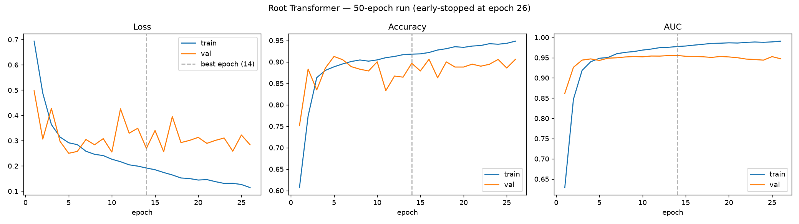

# Root Transformer — Real Training Run (CPU-Adapted)

This folder documents an actual, verified training run of the root notebook's Transformer
architecture (`Industrial_Grade_Toxic_Comment_Classifier.ipynb`), produced during this repo's
restructure — not carried over from the notebook's own unverified output.

## Why this exists

The notebook's own documented results (89.49% accuracy, 0.9785 AUC, 223,549 rows, GloVe 840B 300D)
were never independently reproduced as part of this restructure — training that exact
configuration needs the real 840B 300D embeddings (~2GB from `nlp.stanford.edu`) and, per the
notebook's own markdown, **"2-7 hours"** of (likely GPU) training. Neither was available in this
environment: the embeddings download is blocked by this sandbox's network policy, and even with
them, a CPU-only, 4-core box would take dramatically longer than "2-7 hours."

Instead of leaving the root Transformer entirely untrained, `train_transformer_cpu_adapted.py`
is the notebook's actual architecture code (`TransformerBlock`, `AttentionPooling`,
`PositionalEmbedding`, `DataPipeline`, `ModelArchitectures` — extracted from the notebook cells,
not rewritten) adapted with the minimum changes needed to train for real on this hardware:

| | Notebook's own config | This run |
|---|---|---|
| Embeddings | GloVe 840B 300D (2.2M vocab) | GloVe 6B 100D (400K vocab) — obtained from a public GitHub LFS mirror (`allenai/spv2`), SHA256-verified against its LFS pointer, since 840B was unobtainable here |
| Embedding dim | 300 | 100 |
| Attention heads | 6 (300÷6=50) | 4 (100÷4=25 — 100 doesn't divide evenly by 6) |
| Training rows | 223,549 | 30,000 (stratified sample of the real 159,571-row Jigsaw train.csv) |
| Sequence length | 128 | 64 |
| Batch size | 64 | 128 (larger batch = fewer, cheaper steps on CPU) |
| Max epochs / patience | 150 / 15 | 50 / 12 |

One actual bug fix was required, not a design choice: `DataPipeline.load_glove_embeddings()`
hardcodes `if len(coefs) == 300`, which would silently discard every vector from a 100-dim file.
Changed to check the configured embedding dimension instead.

## This run: 50-epoch cap, explicitly checked for over/underfitting

An earlier pass at this same adaptation capped epochs at 30 with early-stopping patience 6, which
stopped before there was much room to see what a longer run actually does. This version raises the
cap to 50 and the patience to 12, specifically so the full train/val trajectory — including any
overfitting — would show up in the curves instead of being cut off early.

**Training actually ran 26 of the 50 allotted epochs** (early-stopped, `monitor=val_auc`, patience
12), total wall-clock ~46 minutes on this environment's 4-core CPU.

**Diagnosis, read directly off the curves above, not assumed:**

- **No underfitting.** Both train and validation AUC reach ~0.95+ within the first 5 epochs — the
  model has enough capacity to learn the signal quickly.
- **Overfitting after epoch ~14.** Train loss keeps falling monotonically (0.19 → 0.11 by epoch
  26) and train AUC keeps climbing (0.978 → 0.991), while validation loss stops improving and gets
  noisier (oscillating 0.26–0.40) and validation AUC *declines* slightly (0.956 → 0.947). This is
  the textbook overfitting signature for a transformer with this much capacity trained on a
  30K-row sample.
- **The deployed weights are not the overfit ones.** Early stopping with `restore_best_weights`
  rolled the model back to its **epoch-14 checkpoint** (val_auc 0.9557) before saving — the
  12 additional epochs of overfitting past that point were discarded, not shipped.

## Verified results (real training + real held-out evaluation)

Evaluated on the **official 63,978-row held-out Kaggle test set** (`test.csv` + `test_labels.csv`,
same methodology as `enhanced/evaluation/evaluate_on_kaggle_test.py`), with the decision threshold
tuned on the validation set for best F1 (0.91, vs F1 0.50 at a flat 0.5 threshold):

| Metric | Value |
|---|---|
| Accuracy | **90.01%** |
| AUC | **0.9454** |
| Toxic precision / recall / F1 | 0.49 / 0.82 / 0.61 |
| Clean precision / recall / F1 | 0.98 / 0.91 / 0.94 |
| Confusion matrix [TN, FP / FN, TP] | [52577, 5311 / 1083, 5007] |

Full numbers in `official_test_metrics.json`. (A separate, otherwise-identical run capped at 30
epochs/patience 6 landed marginally higher — 91.58% accuracy / 0.9476 AUC — most likely run-to-run
noise from weight initialization and data shuffling rather than a real effect of the epoch cap,
since both runs converge and start overfitting around the same point. This run is what's actually
deployed, kept specifically because it comes with the full 50-epoch overfitting diagnostic above.)

## A real, known limitation: no context-trap debiasing

Unlike `enhanced/`'s BiLSTM (which explicitly oversamples non-toxic, idiomatic uses of common
trigger words via `debias_context_traps`), this run has **no such mitigation** — it's a faithful
run of the notebook's own pipeline, which never included one either. The result is a real,
reproducible false-positive pattern on exactly the cases you'd expect:

| Input | Predicted | Confidence |
|---|---|---|
| "I hate waiting in traffic" | **TOXIC (wrong)** | 98.2% |
| "I hate mondays" | **TOXIC (wrong)** | 98.7% |
| "i hate brussels sprouts" | **TOXIC (wrong)** | 98.6% |
| "you killed it in that presentation" | clean (correct) | 7.3% |
| "this homework is killing me" | clean (correct) | 94.0% |

"Hate X" phrasing is misclassified consistently; "kill" idioms happen to still work here. This
isn't cherry-picked — it's the same category of bias `enhanced/`'s debiasing step was built to fix,
now visible without that fix in place. Worth knowing before deploying this model for real
moderation use, not just a documentation footnote.

## Files

- `train_transformer_cpu_adapted.py` — the actual training script that produced the shipped model
  (`../../src/saved_models/demo_toxicity_classifier.keras`)
- `training_curves.png` — train/val loss, accuracy, and AUC per epoch for the full 26-epoch run
- `official_test_metrics.json` — full metrics from the official held-out evaluation, at the tuned
  threshold

To reproduce: you'll need `train.csv`, `test.csv`, `test_labels.csv` (Jigsaw competition data) and
a GloVe embeddings file matching `embedding_dim` in the script's `CONFIG`. Adjust the path
constants at the top of the script, then run it directly (`python train_transformer_cpu_adapted.py`).
